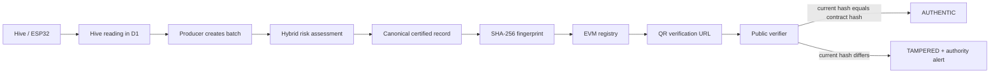

# BeeHive / BeeChain — project context and handover

> **Purpose of this document:** give a new developer, judge, or future agent enough context to understand the product, run it, safely change it, and plan the next stage without reverse-engineering the repository.
>
> **Current status:** a complete, local-first Smart India Hackathon 2026 prototype for SIH26021. It runs against local Cloudflare-compatible services and a real local EVM contract. Production configuration is prepared but nothing has been deployed remotely.

## 1. What this project is

BeeHive (also called BeeChain in the brief) is a honey traceability and beekeeping-management platform. It links physical hive conditions to a harvest record, screens that record for risk, protects a deterministic fingerprint on an EVM blockchain, and makes the proof usable through a public QR passport.

The core product claim is deliberately narrow and defensible:

> AI decides what deserves attention. SHA-256 fingerprints what was certified. Blockchain preserves that fingerprint. A QR lets anybody verify it. Hive intelligence connects the proof back to a physical source.

It does **not** claim that metadata, AI, or blockchain can prove laboratory-grade honey purity. The risk engine is an explainable anomaly screen; authenticity means that the present certified record matches the record fingerprint registered on-chain.

## 2. The story the product demonstrates



Normal flow:

1. A beekeeper records hive telemetry, either through the simulator or an authenticated ESP32 endpoint.
2. The beekeeper selects registered source hives and creates a honey batch.
3. The Worker evaluates explainable risk features such as moisture, evidence, yield, location, timing, duplicate patterns, and hive conditions.
4. The immutable batch fields are normalized into canonical JSON and SHA-256 hashed.
5. The Worker signs a transaction with a server-side signer and registers only the 32-byte fingerprint plus public batch ID in `BeeHiveRegistry`.
6. A QR code points only to `/verify/:publicId`. It does not contain private records, IDs, sessions, documents, or keys.
7. The public verifier reads the current D1 record, re-hashes it, reads the contract record, and issues a verdict.

Tamper flow:

1. A value in the certified database record changes after anchoring, for example `25 kg → 250 kg`.
2. The original on-chain fingerprint does not change.
3. The next public verification calculates a different current hash.
4. BeeHive returns `TAMPERED`, stores a verification event, and creates a deduplicated authority alert.

## 3. What has been implemented

### Product experiences

| Area | What works now |
| --- | --- |
| Homepage | Premium responsive landing page, custom BeeHive mark, isometric hive system visual, interactive trust-chain animation, live-demo preview, architecture explorer, impact sections, and reduced-motion support. |
| Producer workspace | Dashboard metrics, telemetry chart, current hives, active alerts, recent batches, activity timeline. |
| Hive management | Registered hives, current health score, temperature/humidity/weight history, inspection and originating batch context, sensor simulator, per-hive rotating device token. |
| Batch creation | Seven-stage wizard: source, harvest, quality/evidence, traceability review, risk analysis, proof anchoring, and QR passport. |
| Risk engine | Deterministic rules plus anomaly features; score, LOW/MEDIUM/HIGH class, confidence, human-readable reasons, recommendations, feature contributions, version, timestamp, and scope. |
| AI vision scan | Record or upload a clip; keyframes are extracted in the browser and summarised into a field report in one of four modes — honey/comb readiness, environment and hive placement, disease and pest pressure, or a digital twin with modelled weight and a 90-day projection. Simulated prototype output, stored with its keyframes, never part of the certified record. |
| Market risk forecast | Non-video reputational risk prediction built from consumer reviews, public verification events, batch screening and open alerts, with attributable drivers, complaint clusters and a 30/60/90-day outlook. |
| Proof | Versioned canonicalization, Web Crypto SHA-256, Solidity registry, viem broadcast/receipt confirmation, proof lifecycle and transaction details. |
| Public verification | No-login mobile-focused passport; authentic, tampered, pending, not-found, and revoked handling; proof drawer; current/anchored hash comparison; QR generation. |
| Tamper lab | Admin-only controlled golden-record mutation and restoration. It never changes the contract and preserves audit history. |
| Authority workspace | Overview metrics, charts, review queue, alerts, records, review decisions, and notes. |
| Evidence | PDF/PNG/JPEG checks, byte digests, R2 storage, protected downloads, and generated JSON traceability reports. |

### Engineering foundations

- React 19, TypeScript, Vite, React Router, Tailwind CSS, Framer Motion, Recharts, Lucide, Radix Dialog, SWR, Sonner.
- Hono on Cloudflare Workers with D1 and R2 bindings.
- Zod validation shared between browser and Worker where useful.
- Solidity 0.8.30 and viem for actual local EVM transactions.
- D1 schema with foreign keys, indexes, audit logs, sessions, verification events, and alert de-duplication.
- Strict role checks, producer scoping, opaque secure sessions, file signature checks, CORS checks, request budgets, and structured API errors.
- Route-level lazy loading, chart lazy loading, dynamic QR module loading, SVG/CSS/Framer animation rather than a heavy WebGL dependency.

## 4. Current environment and local running state

The local demo uses three services:

| Service | URL / port | Purpose |
| --- | --- | --- |
| Web app | `http://localhost:5174` | React/Vite interface and same-origin `/api` proxy. |
| Worker | `http://localhost:8788` | Hono API with local D1/R2 emulation. |
| Hardhat EVM | `http://127.0.0.1:8545` | Local chain containing the deployed registry. |

The golden public passport is:

```text
http://localhost:5174/verify/BH-2026-000042
```

The golden record is internally consistent:

| Field | Value |
| --- | --- |
| Producer | Mountain Gold Apiary |
| Hive | HIVE-0042 / Acacia ridge |
| Honey | Acacia |
| Origin | Jammu & Kashmir |
| Quantity | 25 kg |
| Risk | 18 / 100, LOW |
| Network | Local EVM (Hardhat) |

Run from the repository root:

```bash
npm install
npm run setup:demo
npm run dev
```

`setup:demo` compiles the contract, starts a local Hardhat node if necessary, deploys the registry, applies local D1 migrations, and seeds data. It creates an ignored local signer in `apps/worker/.dev.vars`; never copy that signer into source control or chat.

`npm run dev` starts the Vite app and Worker. It also runs setup automatically if `.local/ready` is absent. The chain is left running to make restarts convenient.

For a phone on the same Wi-Fi, change `APP_URL` in the ignored local Worker variables to `http://<LAN-IP>:5174`, restart the Worker, and use that LAN URL in the phone. `localhost` on a phone means the phone itself.

## 5. Demo workspace explained

The demo workspace exists only to make the presentation and browser testing frictionless. It is enabled only when `DEMO_MODE=true`.

At `/login`, the role selector logs into seeded accounts without entering a password:

| Demo role | Intended walkthrough |
| --- | --- |
| Producer | Operate Mountain Gold Apiary, inspect hives, simulate readings, make and certify batches. |
| Authority | See alerts, risk records, and record review decisions. |
| Demo admin | Open `/demo/tamper` and run the controlled integrity demonstration. |

The tamper lab can act only on `BH-2026-000042` and only if the current user is an admin **and** `DEMO_MODE=true`. It changes the local certified quantity to 250 kg, never changes the contract, verifies the mismatch, and creates the authority incident. Restore validates the original snapshot against the contract before writing it back. It resolves the open alert but retains audit history.

With production `DEMO_MODE=false`, the demo-login endpoint returns 404 and the tamper route is inaccessible.

## 6. Users, roles, and authorization

The database already has `users`, `sessions`, and `producers` tables. A user has:

- `id`, `name`, and unique lowercase email
- role: `producer`, `authority`, or `admin`
- optional `producer_id` association
- PBKDF2-SHA-256 password hash
- hashed opaque sessions with an eight-hour expiry

The current prototype includes normal email/password login and seeded/demo login. It does **not** yet have public registration, password recovery, invitations, or an admin user-management screen. This is an intentional gap to close before a real rollout.

Authorization behavior:

| Role | Allowed scope |
| --- | --- |
| Producer | Own producer's apiaries, hives, readings, batches, documents, proof actions, and reports. |
| Authority | Cross-producer authority overview, records, alerts, and review decisions. |
| Admin | Producer-level operational access plus admin-only demo controls in demo mode. |
| Public consumer | Only public verification. No login, private IDs, files, sessions, or internal record access. |

### Recommended production account model

Use invitation-based onboarding rather than public self-registration:

1. An administrator creates a producer organization.
2. The administrator invites a producer owner with a time-limited invite.
3. The owner sets a password or signs in through an external identity provider.
4. The owner can add more members only within their producer organization.
5. Authority and admin accounts are provisioned by an administrator, never self-selected.

The next intended feature is an admin-only **Organizations & users** area with producer creation, invitations, role assignment, disabling accounts, password reset, and audit logging. Implement account creation server-side using `passwordHash` from `apps/worker/src/auth.ts`; do not insert raw passwords directly into D1.

## 7. Repository map

```text
.
├── apps/
│   ├── web/                         React application and Cloudflare Pages config
│   │   ├── src/App.tsx               Router, route guards, lazy route loading
│   │   ├── src/pages/                Product screens
│   │   ├── src/components/           Shared UI, animations, charts, shell, passport
│   │   ├── src/lib/api.ts            Same-origin API client and SWR hooks
│   │   ├── functions/api/[[path]].ts Pages → Worker API proxy
│   │   ├── vite.config.ts            Local proxy and build chunks
│   │   └── wrangler.jsonc            Pages deployment configuration
│   └── worker/                      Hono Cloudflare Worker
│       ├── src/index.ts              Middleware and route mounting
│       ├── src/auth.ts               Login, sessions, RBAC helpers
│       ├── src/hives.ts              Hives, readings, simulator, IoT auth
│       ├── src/scans.ts              Vision scans, keyframe storage, forecast
│       ├── src/batches.ts            Batch creation, listing, hydration
│       ├── src/analysis.ts           Risk assessment persistence
│       ├── src/proofs.ts             Canonical hash broadcast and confirmation
│       ├── src/verify.ts             Public integrity verification
│       ├── src/documents.ts          R2 upload/download controls
│       ├── src/passport.ts           QR/report issuance
│       ├── src/authority.ts          Review views/actions
│       ├── src/demo.ts               Narrowly scoped tamper/reset logic
│       ├── wrangler.jsonc            Local Worker bindings
│       └── wrangler.production.jsonc Production template; not deployed
├── packages/
│   ├── shared/src/index.ts           Zod schemas, interfaces, constants
│   ├── shared/src/canonical.ts       Canonical record protocol and SHA-256
│   ├── risk-engine/src/index.ts      Explainable hybrid scoring
│   ├── scan-engine/src/index.ts      Deterministic simulated vision reports
│   ├── scan-engine/src/forecast.ts   Review/verification market-risk forecast
│   └── blockchain/src/               viem client helpers and generated ABI
├── contracts/BeeHiveRegistry.sol     Immutable fingerprint registry
├── migrations/0001_initial.sql       D1 schema
├── migrations/0002_vision_scans.sql  Scans and consumer reviews
├── scripts/                          Local setup, contract compilation/deploy, seed, audit
├── tests/                            Unit, Worker/EVM integration, browser acceptance tests
├── docs/CERTIFICATION.md             Certified payload and trust-boundary specification
├── docs/DESIGN.md                    Visual direction
├── README.md                         Operational quick start and deployment guide
└── CONTEXT.md                        This document
```

### Frontend routes

| Route | Screen |
| --- | --- |
| `/` | Product homepage with the trust-chain and architecture animations. |
| `/login` | Email/password login plus demo selector when enabled. |
| `/dashboard` | Producer overview. |
| `/hives`, `/hives/:id`, `/hives/:id/readings` | Hive management and telemetry. |
| `/batches`, `/batches/new`, `/batches/:id` | Batch list, wizard, detail, proof, QR, documents. |
| `/scan`, `/scan/:id` | AI vision scan studio (camera/upload) and stored scan reports. |
| `/forecast` | Market risk forecast from consumer reviews and verification signals. |
| `/verify`, `/verify/:publicId` | No-login search/scan and public passport. |
| `/authority`, `/authority/alerts`, `/authority/records` | Authority console. |
| `/architecture` | Technical architecture explorer. |
| `/demo/tamper` | Admin-only controlled tamper lab. |

### Important frontend components

| File | Responsibility |
| --- | --- |
| `HeroSystem.tsx` | Original animated hive, telemetry, risk, proof, and passport hero. |
| `TrustChainAnimation.tsx` | Stateful, interactive seven-stage visual explanation of creation through tampering. |
| `SystemArchitecture.tsx` | Selectable animated request paths for batch creation, verification, hive alert, and tamper attack. |
| `Shell.tsx` | Authenticated responsive navigation and route/role protection. |
| `Passport.tsx` | QR generation, public link, QR download, traceability report download. |
| `ScanVisuals.tsx` | Keyframe gallery with detection overlays, digital-twin diagram, placement map, metric and finding lists. |
| `lib/video.ts` | Camera recording, on-device keyframe extraction, and the SHA-256 capture fingerprint. |
| `ui.tsx` | Reusable visual primitives, modal focus handling, counters, risk/health gauges. |
| `styles.css` | The main design system and responsive styles. |

## 8. Backend API and key behavior

All API responses use one of these envelopes:

```ts
{ success: true, data, requestId }
{ success: false, error: { code, message }, requestId }
```

| Area | Routes |
| --- | --- |
| Health | `GET /api/health` |
| Authentication | `POST /api/auth/login`, `POST /api/auth/logout`, `GET /api/auth/me`, `POST /api/auth/demo` |
| Apiaries | `GET /api/apiaries` |
| Hives | `GET/POST /api/hives`, `GET /api/hives/:id`, `GET/POST /api/hives/:id/readings`, `POST /api/hives/:id/simulate`, `POST /api/hives/:id/device-token` |
| IoT | `POST /api/iot/hives/:publicId/readings` with `Authorization: Bearer <device-token>` |
| Vision scans | `GET/POST /api/scans`, `GET /api/scans/:id`, `GET /api/scans/:id/frames/:index`, `GET /api/scans/forecast`, `GET /api/scans/reviews`, `POST /api/scans/reviews/simulate` (demo only) |
| Batches | `GET/POST /api/batches`, `GET /api/batches/:id`, `GET /api/batches/:id/documents` |
| Analysis and proof | `POST /api/batches/:id/analyze`, `/anchor`, `/anchor/confirm`, `/passport` |
| Documents | `POST /api/documents`, `GET /api/documents/:id` |
| Public | `GET /api/verify/:publicId` |
| Authority | `GET /api/authority/overview`, `/alerts`, `/records`; `POST /api/authority/alerts/:id/review` |
| Demo | `POST /api/demo/tamper/:id`, `POST /api/demo/reset/:id` |
| Dashboard/activity | `GET /api/dashboard/metrics`, `GET /api/activity` |

The Worker global middleware does the following before route-specific logic:

- Adds a request ID and disables caching for API output.
- Adds security headers.
- Allows only the configured exact origin for credentialed browser CORS.
- Limits body size to a little over 5 MB.
- Applies D1-backed request budgets: 30 authentication calls or 240 other calls per client per minute.
- Converts expected errors to structured responses.

## 9. Data model

`migrations/0001_initial.sql` is the authoritative schema.

| Tables | Meaning |
| --- | --- |
| `producers`, `users`, `sessions` | Organizations, identities, and opaque sessions. |
| `apiaries`, `hives`, `hive_readings`, `hive_inspections` | Physical source, historic telemetry, and inspections. |
| `batches`, `batch_hives` | Honey batches and their source hives. |
| `batch_documents` | R2 object keys, metadata, raw-byte digest, and attachment links. |
| `ai_assessments` | Versioned assessment JSON and digest. |
| `blockchain_proofs` | Canonical payload snapshot, fingerprint, network, transaction, and receipt state. |
| `hive_alerts`, `authority_reviews` | Risk/hive/integrity incidents and the human review trail. |
| `verification_events`, `audit_logs` | History of checks and actions; neither is used to grant authenticity. |
| `hive_scans` | Vision captures: mode, source, capture digest, R2 keyframe keys, score, class, and the full report JSON. |
| `consumer_reviews` | Market feedback used by the risk forecast. Never part of any certified payload. |
| `rate_limits` | Atomic per-client budget counters. |

Producer ownership is enforced by query filtering in `core.ts` and the caller's `producer_id`. Authority queries intentionally span producers. Important history is append-oriented: a later review, verification, or alert resolution does not rewrite the blockchain proof.

## 10. Risk engine

`packages/risk-engine/src/index.ts` implements the hybrid risk engine without requiring an LLM.

Classification thresholds:

| Score | Class |
| --- | --- |
| 0–30 | LOW |
| 31–70 | MEDIUM |
| 71–100 | HIGH |

Potential features include invalid values, moisture anomalies, unexpected yield per hive, geographic variance, harvest timing, duplicate/near-duplicate metadata, rapid submission velocity, historical deviation, metadata inconsistencies, abnormal hive conditions, missing evidence, and modification history.

Each assessment contains score, class, heuristic confidence, reasons, recommendations, feature contributions, a version, timestamp, and a scope note. The golden score is exactly 18: 10 for no certificate and 8 for absent optional lab values.

Future optional Workers AI should only turn the already-computed assessment into a natural-language advisory. It must not become a gate for core functionality or be described as a laboratory purity test.

## 11. AI vision scan and market risk forecast

This is the prototype's field-facing intelligence layer. It is deliberately separated from the certification path: **no vision output and no review signal ever enters the canonical record, the SHA-256 fingerprint, or the contract.**

### Capture path

1. The producer picks a mode and records up to 12 seconds in the browser, or uploads a clip. `apps/web/src/lib/video.ts` owns both paths. A recording grabs keyframes from the live preview while `MediaRecorder` runs, which avoids seeking a WebM blob that carries no duration metadata; an upload seeks the decoded video and draws each frame to a canvas.
2. The browser computes `SHA-256` over the captured bytes — the **capture fingerprint** — and exports up to four JPEG keyframes at 640 px.
3. Only the metadata and the keyframes are uploaded (`POST /api/scans`, multipart). **The video file itself never leaves the device**, which keeps the request inside the Worker's 5 MB body limit and avoids storing personal footage.
4. The Worker validates the mode, the apiary and hive ownership, and each keyframe's magic bytes, stores keyframes in R2 under `scans/<producerId>/<scanId>/<index>`, then runs the report and persists it to `hive_scans`. A failed database write deletes the R2 objects it just wrote.

### Report engine

`packages/scan-engine/src/index.ts` is a deterministic simulation, not a model:

- The capture fingerprint plus the mode seeds a mulberry32 PRNG, so **the same clip always produces the same report** — a demo can be rehearsed and a reviewer can reproduce it.
- Every mode is grounded in real workspace data where it exists: the hive's latest temperature, humidity, load-cell weight and health score, the seven-day weight trend, and the apiary's registered coordinates. A stressed colony really does read as higher disease pressure.
- Output shape mirrors the risk engine: `score` (0–100 risk), `classification` from the shared `classification()` thresholds, confidence, metrics with bands and benchmarks, findings with severity, confidence and a bounding region tied to a keyframe, recommendations, engine version, timestamp, and a `scope` disclaimer.

| Mode | Produces |
| --- | --- |
| `HONEY_QUALITY` | Capped-cell share, estimated moisture, crystallisation, Pfund colour, debris, harvest readiness. |
| `ENVIRONMENT` | Site suitability, forage density, sun hours, wind, water distance, slope, disturbance, plus three ranked stands with orientation and cautions. Needs no hive. |
| `DISEASE` | Ranked disease signatures with probability and treatment window, mite load, brood-pattern regularity, entrance mortality, deformed-wing indicator. |
| `DIGITAL_TWIN` | Boxes, per-frame role map, comb coverage, population, brood area, stores, a weight breakdown that reconciles against the load cell, and 30/60/90-day weight, yield and risk projections with expected disease pressure. |

A `HIGH` classification on a hive scan opens a deduplicated `VISION_SCAN` alert, which surfaces in the producer dashboard and the authority console like any other incident.

### Market risk forecast

`packages/scan-engine/src/forecast.ts` answers the other half of the brief: a predicted risk score with **no video at all**. It combines the `consumer_reviews` corpus with real platform signals — public verification verdicts, anchored-proof coverage, average certified batch risk, and open alerts — into an attributable score: every driver states its point contribution and why. Proof coverage and reviews left by buyers who scanned the QR passport reduce the score; authenticity doubt, tampered verifications and complaint clusters raise it. `POST /api/scans/reviews/simulate` (demo mode only) delivers an inbound review so the forecast can be seen moving live.

### Deliberate limits

- Reports are labelled *simulated prototype scan* in the interface and carry a scope note in the payload.
- Scans are producer-scoped; keyframes are served only to their owner through an authenticated route.
- Replacing the simulation with a real model means swapping `simulateScan` for an inference call and keeping the same `ScanReport` shape. Nothing else in the system needs to change.

## 12. Canonicalization and verification trust boundary

The certified-record protocol is specified in `docs/CERTIFICATION.md` and implemented in `packages/shared/src/canonical.ts`.

Certified fields include schema version, public ID, producer/source identity, apiary/origin, honey and harvest details, quality measurements, lot/extraction data, certificate byte digest, assessment digest, and creation time. Notes, database primary keys, current statuses, authority reviews, later sensor readings, passwords, and documents are not part of the certified batch payload.

Normalization rules:

1. Validate an explicit strict schema; reject unknown fields.
2. Sort object keys recursively.
3. NFC-normalize strings, trim them, and collapse whitespace.
4. Preserve explicit nulls; reject undefined and non-finite values.
5. Use ECMAScript JSON number representation, normalizing `-0` to `0` without rounding measurements.
6. Normalize timestamps to UTC milliseconds and validate harvest calendar dates.
7. Sort source hive IDs as a duplicate-free set; preserve the order of other arrays.
8. UTF-8 encode and SHA-256 hash the canonical text, returning a `0x`-prefixed 32-byte value.

The verifier does not trust a D1 `status` field or copied stored hash. It independently:

1. Gets the current row for the requested public ID.
2. Computes the current canonical payload fingerprint.
3. Recomputes/checks the committed assessment digest.
4. Calls `getRecord(publicId)` on the configured contract.
5. Compares that specific contract fingerprint with the current fingerprint.

An unavailable chain returns `PENDING`, not `AUTHENTIC`. A confirmed record with malformed changed data or a missing/changed committed assessment becomes `TAMPERED`.

## 13. Blockchain integration

`contracts/BeeHiveRegistry.sol` stores only a fingerprint and public reference. It has:

- `registerRecord(bytes32 recordHash, string publicId)`
- `verifyRecord(bytes32 recordHash)`
- `getRecord(string publicId)`
- owner-controlled registrar access
- zero-hash, duplicate-hash, duplicate-public-ID, and unauthorized-registrar rejection
- a `RecordRegistered` event

The Worker, never the browser, holds the signing key and uses `packages/blockchain/src/index.ts` to simulate, broadcast, then confirm a transaction. A proof is only marked `ANCHORED` after the receipt and registry value are checked. Repeated actions are idempotent where possible, and recoverable if a transaction has already mined.

### Local versus production chain

| Environment | Chain | Signer | Purpose |
| --- | --- | --- | --- |
| Local | Hardhat, chain ID 31337 | Random key written to ignored `.dev.vars` | Fully functioning no-cost development demo. |
| Production candidate | EVM testnet such as Sepolia | Dedicated funded Worker secret | Public proof demonstrations. |
| Mainnet | Not configured | Would require a separately governed production signer | Not needed for this prototype. |

Never put `BLOCKCHAIN_PRIVATE_KEY` in the frontend, `VITE_*` settings, source files, docs, QR payload, or chat. Keep it only as a Cloudflare Worker secret in a production deployment.

## 14. Security controls already present

- Zod server-side input validation and route-specific authorization.
- Producer ownership filtering and role-based access checks.
- Random opaque session tokens stored only as SHA-256 hashes, with HttpOnly, SameSite=Lax cookies and Secure cookies under HTTPS.
- PBKDF2-SHA-256 passwords with 100,000 iterations.
- Exact-origin credentialed CORS; no wildcard origins.
- D1 parameterized statements.
- API request budgets and `Retry-After` responses.
- R2 upload size limit, MIME allowlist, PDF/PNG/JPEG magic-byte validation, randomized object keys, safe filenames, byte digests, ownership-protected downloads, and R2 cleanup after a failed database write.
- Device tokens generated per hive, stored hashed, and invalidated by rotation.
- QR contents limited to a public verification URL.
- No complete batch records, documents, private user IDs, sensor tokens, or keys stored on-chain.
- Demo operations gated by environment flag, admin role, and golden-record ID.

Security work still needed for a real service includes password reset and email verification, MFA or external identity provider integration, invite flows, production rate-limit retention/cleanup policy, document malware scanning and retention rules, secret rotation operational procedures, chain signer custody policy, dependency monitoring, disaster recovery, and external security review.

## 15. Production deployment path

This repository is configured for Cloudflare but is currently intentionally local-only.

### Needed before deploying

1. A production domain and final `APP_URL`, for example `https://beehive.example.in`.
2. A dedicated Cloudflare D1 database and R2 bucket.
3. A funded dedicated EVM testnet signer and testnet RPC provider.
4. A deployed `BeeHiveRegistry` contract on the same configured chain.
5. `CONTRACT_ADDRESS`, RPC, chain details, and exact Pages domain set in `apps/worker/wrangler.production.jsonc` or equivalent deployment configuration.
6. `BLOCKCHAIN_PRIVATE_KEY` uploaded as a Worker secret, never put in config source.
7. `DEMO_MODE=false`.
8. An account provisioning path before external users can access the system.

### Deployment sequence

```bash
# Create Cloudflare resources once.
npx wrangler d1 create beehive-db
npx wrangler r2 bucket create beehive-evidence

# Put the returned D1 database_id in apps/worker/wrangler.production.jsonc.

# Deploy registry with an ignored, funded testnet environment file.
node --env-file=.env.testnet --import tsx scripts/deploy-contract.ts --testnet

# Copy only the resulting public contract address into production config.
npx wrangler secret put BLOCKCHAIN_PRIVATE_KEY --config apps/worker/wrangler.production.jsonc

# Create schema and deploy API.
npx wrangler d1 migrations apply beehive-db --remote --config apps/worker/wrangler.production.jsonc
npm run deploy:worker

# Build and deploy the web app.
npm run build
npm run deploy:web
```

The Pages function at `apps/web/functions/api/[[path]].ts` must have an `API` service binding pointed at the deployed Worker. This is what keeps the browser calls same-origin and allows the session cookie to work with the Pages domain.

Use `apps/worker/wrangler.production.jsonc`, not the local `wrangler.jsonc`, for a real deployment. Confirm the configured `APP_URL` exactly matches the Pages/custom domain; mismatch will correctly block credentialed browser requests through CORS.

## 16. Seed data and known demo content

`scripts/seed-demo.ts` creates:

- 3 producers
- 3 apiaries
- 10 hives
- 21 days of four readings per hive (840 readings)
- 36 batches with low, medium, high, draft, analyzed, and anchored states
- inspections, alerts, verification activity, and real local-chain proofs
- three demo users and an ignored generated password file for normal-login testing
- 74 consumer reviews across the three producers, spread over six months
- four AI vision scans (`SCAN-HONEY01`, `SCAN-BROOD01`, `SCAN-TWIN001`, `SCAN-SITE001`) generated by the real scan engine

It is idempotent for seeded rows. New local demo actions add records rather than deleting the seeded demonstration history.

## 17. Commands and verification

| Command | Use |
| --- | --- |
| `npm run setup:demo` | Initialize or refresh local chain, schema, contract, and data. |
| `npm run dev` | Start Worker and Vite app. |
| `npm run typecheck` | Check the TypeScript project. |
| `npm run build` | Typecheck and make a production frontend build. |
| `npm run test` | Unit plus isolated Worker/D1/R2/EVM integration tests. |
| `npm run test:e2e` | Playwright browser acceptance tests; requires local dev services. |
| `node scripts/audit-ui.mjs` | Desktop/mobile accessibility and page-overflow audit. |
| `npm run deploy:check` | Package a Worker dry run; does not deploy. |
| `npm audit` | Check dependency advisories. |

Latest verified state at the time this document was written:

- `npm run test`: **50 tests passed**.
- `npm run test:e2e`: **5 browser acceptance tests passed**.
- `npm run build`: passed.
- `npm run deploy:check`: passed without deployment.
- `npm audit`: zero known vulnerabilities at the checked audit level.
- Accessibility audit: no automated WCAG violations or page-width overflow across 33 desktop and mobile route checks.

The acceptance tests cover the normal producer flow through simulated stress, batch creation, real contract anchoring, QR/report issuance, no-login verification, tampering, authority alert visibility, reset, animation interactions, reduced motion, mobile layout, the public proof drawer, keyboard focus return, and the vision scan and forecast screens.

## 18. Design and motion decisions

Visual direction lives in `docs/DESIGN.md`.

- Palette: paper surfaces, near-black ink, honey amber, restrained meadow green, and red only for integrity mismatch.
- Type: Manrope display/headings and DM Sans for product interface text.
- The hero is an asymmetric field-station composition with a custom SVG hive and data layers, not stock imagery or generic crypto visuals.
- The trust chain and system architecture are real interactive SVG/Framer stateful components, not prerecorded video or a static illustration.
- Motion respects `prefers-reduced-motion`, pauses offscreen where appropriate, and provides pause/restart and stage-selection controls.
- Mobile public verification is treated as a first-class route because it is the likely consumer scanning context.

## 19. Important non-goals and limits

- The application does not certify physical honey purity or replace laboratory testing.
- The risk score is a prototype heuristic, not a calibrated fraud probability or regulatory decision engine.
- The AI vision scan is a deterministic simulation for demonstration. It does not run a trained model, diagnose colony disease, or measure honey in a laboratory sense, and its output is never certified or anchored.
- The market risk forecast predicts reputational and commercial exposure from reported signals. It is not a statement about product quality.
- An on-chain anchor proves integrity of the submitted certified payload, not the truth of every producer claim.
- There is no public registration, invitation, user administration, password reset, MFA, laboratory integration, or full fleet/device lifecycle management yet.
- The Hardhat network is a local testing environment and has no public durability.
- A public testnet is sufficient for a competition demonstration; do not use a mainnet signer without separate governance, cost, security, and finality decisions.

## 20. Best next implementation sequence

If continuing the product beyond the current prototype, work in this order:

1. Build an admin **Organizations & users** workflow with secure account creation/invites and audit records.
2. Add password reset/email verification or integrate a managed identity provider.
3. Deploy a testnet registry with a dedicated funded signer, remote D1/R2, and a Pages custom domain.
4. Add production monitoring, error alerting, backups, and secret rotation procedures.
5. Define producer onboarding and document/lab-evidence review processes.
6. Harden upload policy with malware scanning and retention/deletion policy.
7. Add real ESP32 device provisioning, token rotation UX, and telemetry reliability monitoring.
8. Conduct end-to-end testnet, security, and load testing before inviting external users.

## 21. Quick orientation for a future developer

When changing a feature, start in this order:

1. Find the shared type and Zod schema in `packages/shared/src/index.ts`.
2. Find the route handler in `apps/worker/src` and enforce ownership/role checks there.
3. Update the D1 migration only for new persisted fields; do not retroactively alter certified payload semantics.
4. If a certified field changes, explicitly decide whether to version `beehive.record.v1` and update `docs/CERTIFICATION.md`, canonicalization tests, and contract-facing flow.
5. Update the React route/component and its loading/error/accessibility states. Vision scan work lives in `apps/worker/src/scans.ts`, `packages/scan-engine/`, `apps/web/src/pages/Scan.tsx` and `Forecast.tsx`; none of it may touch the canonical payload.
6. Add a meaningful test at the appropriate layer: unit, Worker/EVM integration, or browser acceptance.
7. Run typecheck, tests, and build before handoff.

The most critical invariant to protect is this:

> A public `AUTHENTIC` result must always come from independently recalculating the current certified data fingerprint and comparing it to the fingerprint bound to that exact public ID in the configured EVM registry.

