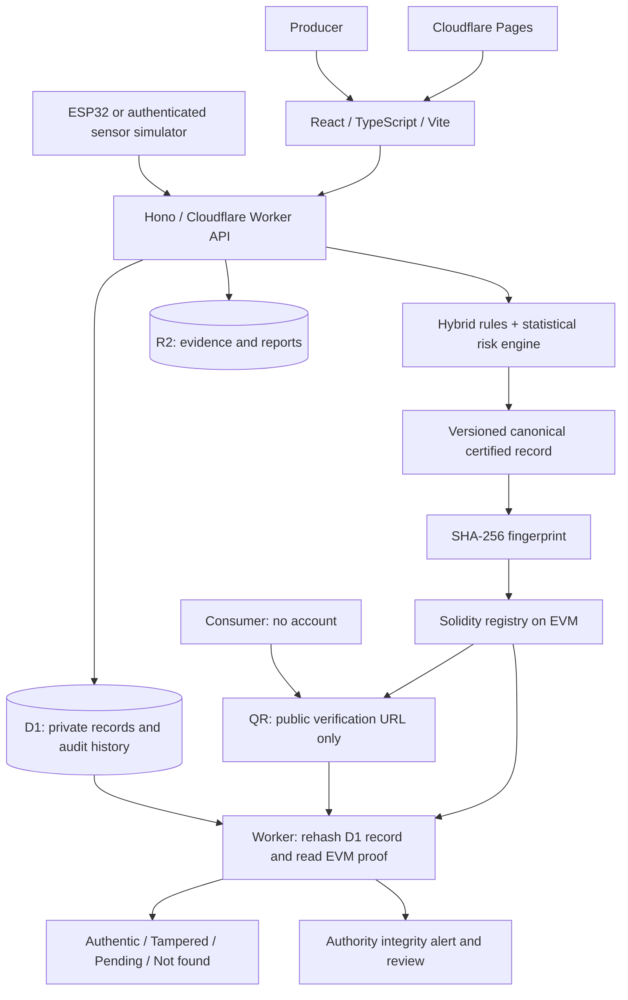

# BeeHive / BeeChain

A working Smart India Hackathon 2026 prototype for **SIH26021**: connected hive management, explainable honey metadata risk screening, deterministic SHA-256 certification, a Solidity registry, public QR passports, and authority review.

The prototype executes real transactions against a local Hardhat EVM. It does not need Cloudflare credentials, a funded testnet wallet, an LLM, or a physical hive to run locally.

## Start locally

Requires Node.js 22.12+ (tested with Node 24) and npm.

```bash
npm install
npm run setup:demo
npm run dev
```

Open **http://localhost:5174**. Select **Launch dashboard → Producer → Enter demo workspace**. The three demo roles are available on `/login`; there is no password to type when using the role selector.

| Local service          | Address                                     |
| ---------------------- | ------------------------------------------- |
| React / Vite frontend  | http://localhost:5174                       |
| Cloudflare Worker API  | http://localhost:8788/api/health            |
| Hardhat EVM JSON-RPC   | http://127.0.0.1:8545                       |
| Golden public passport | http://localhost:5174/verify/BH-2026-000042 |

Ports 5174 and 8788 intentionally avoid other common local apps. The browser calls `/api` through Vite's same-origin proxy. Do not open the frontend on a different host without updating `APP_URL`; strict CORS checks the exact configured origin.

To scan a QR using a physical phone on the same Wi-Fi, set `APP_URL=http://<computer-LAN-IP>:5174` in ignored `apps/worker/.dev.vars`, restart the Worker, and open the app at that same LAN address before generating the QR. `localhost` on a phone refers to the phone itself.

`npm run setup:demo` starts a detached local EVM if needed, compiles and deploys `BeeHiveRegistry`, migrates local D1, and seeds the demo. It saves a newly generated **local-only** signing key in ignored `apps/worker/.dev.vars` with restrictive permissions. Startup logs never print that signer. Hardhat's standard accounts are public test accounts and must never hold real funds.

`npm run dev` starts the frontend and Worker. It runs setup automatically if the local demo is not ready. Closing it stops the frontend and API; the local EVM remains running for convenient restarts. To stop the detached EVM started by setup:

```bash
kill "$(cat .local/chain.pid)"
```

Do this only when that PID file exists and the process is the BeeHive local node. Its logs are in `.local/chain.log`. After restarting an ephemeral Hardhat chain, run setup again: existing local certified snapshots are re-registered on the new isolated registry, with new receipts recorded. This is a local development convenience; a testnet registry is never reset by these scripts.

## The five-minute demo

1. On `/login`, enter the **Producer** demo workspace. Open **Hive intelligence → Acacia ridge / HIVE-0042**.
2. Click **Simulate Hive Stress**. A real D1 reading and persistent warning appear. Click **Simulate Healthy Data** to restore current healthy telemetry. Historical readings and alerts remain available for review.
3. Create a honey batch. Select **Lidder Valley Apiary** and a source hive, enter harvest details and a distinct lot reference. Evidence upload is optional; missing evidence contributes to the score.
4. Review traceability and click **Run risk analysis**. Read the feature reasons and recommendations.
5. Continue to proof and **Generate & anchor proof**. The Worker canonicalizes the record, hashes it, signs and broadcasts a real Solidity registration, then verifies the receipt and contract value.
6. Download the QR label or traceability report, then open the generated QR passport in a private browser session. It requires no login. **View Technical Proof** compares a freshly calculated hash with the contract's fingerprint.
7. Sign out and enter the **Demo admin** workspace. `/demo/tamper` loads the golden record: Mountain Gold Apiary, Acacia honey, HIVE-0042, Jammu & Kashmir, **25 kg**, **18 / 100 LOW**.
8. Click **Simulate Database Tampering**. Only the golden record quantity becomes **250 kg**. The blockchain remains unchanged. Open or reload its public passport: **TAMPERED**.
9. Open **Authority console → Alerts & reviews**. Review the integrity incident, inspect the record, and save a decision with notes.
10. Return to **Tamper lab → Restore Demo**. The exact snapshot is restored only after its hash matches the chain. The passport returns **AUTHENTIC**; audit and incident history are preserved.
11. Open **AI vision scan**. Pick a mode, record a short clip or upload one, and run the analysis: keyframes are extracted in the browser and returned as a field report with detections drawn on the frames. Open **SCAN-TWIN001** from the history for the digital twin, and **Risk forecast** for the review-driven prediction.
12. On the homepage, play the trust-chain animation. Pause, restart or click a stage. Open `/architecture` and select **Create Batch**, **Verify Batch**, **Hive Alert**, or **Tampering Attack**.

The lab is gated by **both `DEMO_MODE=true` and the admin role** and is limited to the golden seeded record. Ordinary producers cannot invoke it. The animated walkthrough uses visibly labeled illustrative hashes; the application and proof drawer use real computed hashes and transaction receipts.

## Architecture



### Repository

```text
apps/web/             React routes, UI, animations, dashboards and QR passports
apps/worker/          Hono API, authentication, D1/R2 access and proof orchestration
packages/shared/     Zod schemas, shared types and canonical JSON / SHA-256
packages/risk-engine/ Explainable rules and statistical deviation features
packages/blockchain/ viem client, contract ABI and receipt confirmation
contracts/           BeeHiveRegistry.sol
migrations/          D1 schema, indexes and foreign keys
scripts/             Local orchestration, deployment, compilation and demo seed
tests/               Unit, real Worker/EVM integration and Playwright acceptance tests
docs/                Design and technical decisions
```

The frontend uses React Router, Tailwind CSS, Radix Dialog, Framer Motion, Recharts, Lucide, SWR and self-hosted Manrope / DM Sans fonts. Dashboard charts and major routes are lazy-loaded. Animations use SVG and Framer Motion, with reduced-motion support. No WebGL, extra microservices, queues or LLM service is required.

### Data model

| Tables                              | Purpose                                                        |
| ----------------------------------- | -------------------------------------------------------------- |
| `users`, `sessions`, `producers`    | Role-bound identities and expiring hashed sessions             |
| `apiaries`, `hives`                 | Registered source, location, queen and colony metadata         |
| `hive_readings`, `hive_inspections` | Historical physical observations                               |
| `batches`, `batch_hives`            | Certified batch metadata and its source hives                  |
| `batch_documents`                   | R2 object references, byte digests and upload metadata         |
| `ai_assessments`                    | Versioned assessments, features, reasons and digests           |
| `blockchain_proofs`                 | Canonical snapshot, SHA-256, registry, transaction and receipt |
| `verification_events`               | Every verification verdict and both compared hashes            |
| `hive_alerts`, `authority_reviews`  | Hive, risk and integrity incidents plus decisions              |
| `audit_logs`                        | Historical actions, actors, entity references and explanations |
| `hive_scans`                        | Vision captures, R2 keyframe keys and the stored scan report    |
| `consumer_reviews`                  | Market feedback behind the risk forecast                        |
| `rate_limits`                       | Atomic per-client and per-minute request budgets               |

The migration enables foreign keys and adds producer/time indexes and partial uniqueness constraints for open alerts. Ordinary API operations do not overwrite certified records. Assessment creation and state transitions use D1 transactions. Demo restoration resolves incidents without deleting history.

## Risk screening

`packages/risk-engine/src/index.ts` implements an explainable hybrid engine. Thresholds are **prototype heuristics**, not validated laboratory models. The score is capped at 100: **LOW 0–30**, **MEDIUM 31–70**, **HIGH 71–100**.

Features include per-hive quantity, moisture ranges, certificate availability, missing optional HMF/diastase measurements, nearby hive conditions, geographic distance, duplicate metadata, submission velocity, historical quantity z-score, harvest timing, invalid metadata and modification history. Results contain the score, classification, evidence-coverage confidence, reasons, recommendations, feature contributions, version, timestamp and explicit scope. Confidence is a heuristic coverage indicator, not a calibrated probability.

The golden score of 18 comprises **10 points for no attached certificate + 8 points for missing optional lab values**. The demo does not pretend to possess a laboratory report it does not have. High-risk batches may still receive a fingerprint: anchoring records what was submitted, including the risk assessment; it does not approve the product. Authorities receive high-risk cases.

Workers AI is deliberately optional and not required or called. Deterministic, readable explanations are always available. Neither the AI nor the blockchain can establish physical honey purity from metadata.


## AI vision scan (prototype simulation)

`packages/scan-engine/` powers the producer's field intelligence. A clip is recorded or uploaded, **the browser extracts keyframes and a SHA-256 capture fingerprint, and only those keyframes leave the device** — the video is never uploaded or stored. The fingerprint seeds a deterministic model, so the same clip always returns the same report, and every mode is grounded in the hive's real telemetry and the apiary's registered coordinates.

| Mode | Answers |
| --- | --- |
| Honey & comb | Is this frame ready to extract? Capping, estimated moisture, colour, debris, readiness. |
| Environment & placement | Where should the next hive stand go? Suitability, forage, sun, wind, water, three ranked stands. |
| Disease & pest | What is building in this colony? Ranked signatures, mite load, brood pattern, treatment windows. |
| Digital twin | What is in the box? Structure, per-frame roles, population, stores, a weight breakdown reconciled against the load cell, and 30/60/90-day weight, yield and disease projections. |

A HIGH result opens a `VISION_SCAN` alert for the producer and the authority console. Reports are labelled as simulated in the interface and in the payload's `scope` field.

**Trust boundary:** no vision output and no consumer review is ever part of the canonical record, the SHA-256 fingerprint, or the contract. Swapping the simulation for a real model means replacing `simulateScan` and keeping the `ScanReport` shape.

## Market risk forecast (no video)

`packages/scan-engine/src/forecast.ts` predicts reputational exposure from consumer reviews plus real platform signals: public verification verdicts, anchored-proof coverage, average certified batch risk and open alerts. Every driver reports the points it contributes and why, complaint themes are clustered from low-rated reviews, and the score is projected over 30/60/90 days. In demo mode, **Receive a consumer review** delivers an inbound review so the forecast can be watched moving.

## Canonical record and hashing

See [docs/CERTIFICATION.md](docs/CERTIFICATION.md). Certified fields are explicitly enumerated in a strict Zod schema, including producer/source identity, origin, harvest, quantity, lab measurements, extraction and lot details, certificate digest, assessment digest and timestamps.

Keys sort lexicographically; strings normalize to Unicode NFC with collapsed whitespace; nulls remain explicit; numbers use finite ECMAScript shortest JSON representations without rounding; timestamps normalize to UTC; source hive IDs are a sorted set. Unknown fields, undefined values, non-finite numbers and duplicate source IDs reject. Other array order is preserved. The payload is hashed using Web Crypto SHA-256, returning a `0x`-prefixed 32-byte digest.

The public verifier hashes **the current database record** and calls `getRecord(publicId)` on the configured contract. It also checks that the assessment matches its committed digest. It does not trust a database boolean or cached authentic badge. **A chain outage or missing registration returns pending**. Public verification responses use `Cache-Control: no-store` to avoid hiding a tamper event.

## Blockchain

`BeeHiveRegistry.sol` provides `registerRecord(bytes32,string)`, `verifyRecord(bytes32)`, `getRecord(string)` and owner-managed authorized registrars. It rejects zero hashes, duplicate hashes, duplicate public references and unauthorized registrations, and emits `RecordRegistered`. Only fingerprints and public references are exposed; complete records and private documents stay off-chain.

```bash
npm run chain:compile
npm run chain:node       # optional manual node management
npm run chain:deploy     # local deployment; random local signer
```

The Worker returns an actual transaction hash when broadcasting and exposes a separate confirmation endpoint. Repeated anchoring is idempotent. Failed submission can be retried; an already-mined registration can be recovered from contract events. The UI stays pending while confirmation is unavailable. One confirmation is sufficient for this prototype; production policy should choose a chain-appropriate finality depth.

For a testnet later, fund a dedicated testnet signer, supply an ignored environment file, and run:

```bash
node --env-file=.env.testnet --import tsx scripts/deploy-contract.ts --testnet
```

Set the resulting address in the production Worker config. Upload its signing key only with `wrangler secret put BLOCKCHAIN_PRIVATE_KEY --config apps/worker/wrangler.production.jsonc`. Never use a `VITE_` variable for keys. The local demo is explicitly labeled **Local EVM (Hardhat)** and is not represented as Sepolia.

## API

All responses use `{ success, data, requestId }` or `{ success: false, error: { code, message }, requestId }`.

| Area       | Routes                                                                                        |
| ---------- | --------------------------------------------------------------------------------------------- |
| Health     | `GET /api/health`                                                                             |
| Auth       | `POST /api/auth/login`, `/demo`, `/logout`; `GET /api/auth/me`                                |
| Sources    | `GET /api/apiaries`; `GET/POST /api/hives`; `GET /api/hives/:id`                              |
| Telemetry  | `GET/POST /api/hives/:id/readings`; `POST /api/hives/:id/simulate`                            |
| IoT        | `POST /api/hives/:id/device-token`; `POST /api/iot/hives/:publicId/readings`                  |
| Batches    | `GET/POST /api/batches`; `GET /api/batches/:id`, `/api/batches/:id/documents`                 |
| Evidence   | `POST /api/documents`; `GET /api/documents/:id`                                               |
| Risk/proof | `POST /api/batches/:id/analyze`, `/anchor`, `/anchor/confirm`, `/passport`                    |
| Public     | `GET /api/verify/:publicId`; demo-only `GET /api/public/preview`                              |
| Authority  | `GET /api/authority/overview`, `/alerts`, `/records`; `POST /api/authority/alerts/:id/review` |
| Demo admin | `POST /api/demo/tamper/:id`, `/reset/:id`                                                     |
| Vision     | `GET/POST /api/scans`; `GET /api/scans/:id`, `/api/scans/:id/frames/:index`                   |
| Forecast   | `GET /api/scans/forecast`, `/api/scans/reviews`; demo-only `POST /api/scans/reviews/simulate` |
| Dashboard  | `GET /api/dashboard/metrics`; `GET /api/activity`                                             |

### ESP32 integration

On the hive detail screen, expand **Connect an ESP32 device** and generate a device token. Save it on the device; rotating it invalidates the previous token. Device tokens are hashed at rest.

```http
POST /api/iot/hives/HIVE-0042/readings
Authorization: Bearer <per-device-token>
Content-Type: application/json

{"temperature":34.1,"humidity":56,"weight":38.2,"activity":87}
```

Readings accept a recent ISO timestamp or use the server time. Invalid temperatures/humidity/weights and future or stale timestamps reject. Devices use this endpoint without a browser user session.

### Local seed

`npm run seed:demo` is local-only, idempotent for seed rows, and requires the local registry to be running. It creates three producers, three apiaries, ten hives, 21 days of four daily readings per hive (840 readings), 36 batches, low/medium/high-risk assessments, inspections, alerts, real local proofs and verification events. Two drafts and two analyzed batches demonstrate in-progress states. Normal demo work adds new records without deleting seed or audit history.

For testing the normal password form, local generated credentials are in ignored `.local/demo-credentials.json`. This password is generated on first seed and is not committed. Public demo role login is disabled when `DEMO_MODE=false`.

## Security and prototype boundaries

- Server-side Zod validation; strict source ownership and role authorization.
- Random opaque sessions, SHA-256 at rest, 8-hour expiry, HttpOnly and SameSite=Lax cookies; Secure on HTTPS.
- PBKDF2-SHA-256 password hashing (100,000 iterations) and Web Crypto verification for secret comparisons.
- Exact origin allowlist and no credentialed wildcard CORS.
- Atomic D1 request budgets: 30 authentication requests / minute and 240 other API requests / minute per client. IoT supports non-browser authenticated requests.
- Parameterized D1 queries; no client-selected SQL identifiers.
- Upload limits, MIME allowlist, file-signature checks, random object keys, ownership checks and attachment downloads. Evidence is never executable HTML.
- Scan captures stay on the device: only browser-extracted keyframes are uploaded, with the same MIME allowlist, signature checks and per-producer download protection as evidence. Vision reports and consumer reviews are excluded from every certified payload.
- Keys remain in ignored local files or Worker secrets; QR codes contain URLs only.
- Demo controls require admin authorization and an explicit demo environment, and target only the golden record.
- Certificate fingerprints commit uploaded bytes. Public record integrity does not validate laboratory accreditation or the truth of producer-submitted data.

This is a competition prototype, not a completed regulatory accreditation, calibrated purity model, or adversarially audited production system. Password recovery, onboarding, multi-factor authentication, laboratory integrations and a production device fleet are future work. Uploaded files receive type/signature validation; a production upload policy should additionally define scanning and retention.

## Checks

```bash
npm run test           # SHA-256, canonicalization, risk, vision/forecast engines, real Worker + D1 + R2 + isolated EVM
npm run typecheck
npm run build
npm run deploy:check   # local Worker package dry-run; does not deploy
npx playwright install chromium
npm run test:e2e       # run with npm run dev already serving 5174 / 8788
npm audit
node scripts/audit-ui.mjs # desktop/mobile route accessibility and overflow audit
```

The integration suite starts an isolated Hardhat node on port 18545 and a Miniflare Worker with separate in-memory D1/R2 storage. It never tampers with the user's local demo data. Browser acceptance tests create a sample batch and use the explicitly controlled golden tamper/reset flow. Browser screenshots and reports go to ignored `.local`, `test-results`, and `playwright-report` directories.

## Cloudflare deployment (prepared, not deployed)

Local testing is the current delivery target. Production config is separate and **demo mode defaults to false**. For later deployment, use Cloudflare Pages for `apps/web/dist` and `apps/worker/wrangler.production.jsonc` for the Worker. Create a dedicated D1 database and R2 bucket, set their bindings, configure the funded testnet registry and Worker secret, and apply migrations remotely. Set `APP_URL` to the exact Pages/custom-domain origin.

```bash
npx wrangler d1 create beehive-db
npx wrangler r2 bucket create beehive-evidence
# Put the returned D1 database_id into wrangler.production.jsonc.
npx wrangler d1 migrations apply beehive-db --remote --config apps/worker/wrangler.production.jsonc
npm run deploy:worker
npm run build
npm run deploy:web
```

The Pages function in `apps/web/functions/api/[[path]].ts` proxies `/api/*` to the `API` service binding, keeping HttpOnly sessions same-origin. Configure that service binding to the deployed `beehive-api` Worker. The deployment configs enable logs and sampled traces. No deployment is performed by setup, seed, tests or dev commands. Do not deploy the local config to a shared or production environment.

Wrangler config and D1/R2 integration were checked against the [Cloudflare configuration reference](https://developers.cloudflare.com/workers/wrangler/configuration/), [D1 API](https://developers.cloudflare.com/d1/worker-api/d1-database/), and [R2 Workers API](https://developers.cloudflare.com/r2/api/workers/workers-api-reference/).
